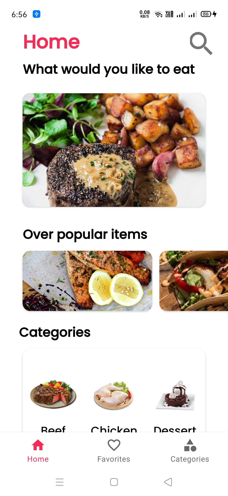
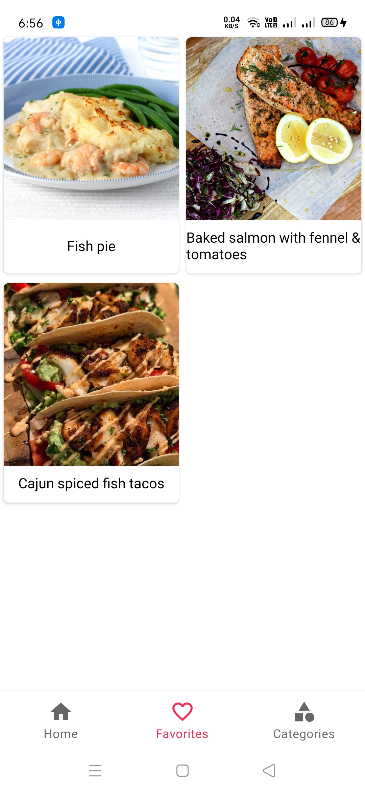
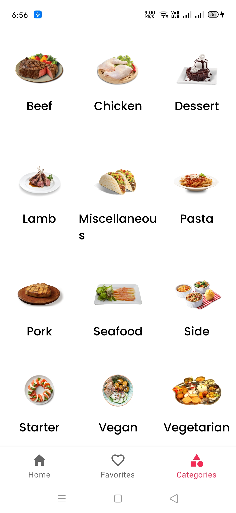
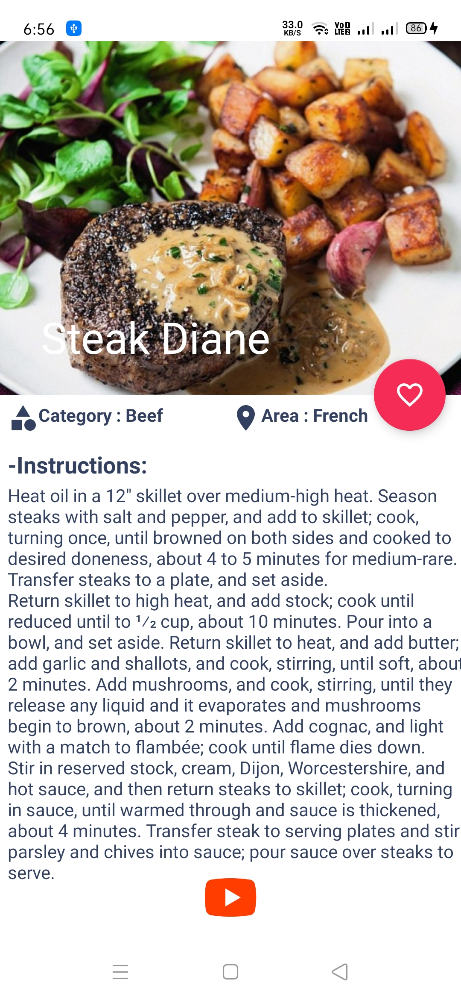

# Recipe Food App :man_cook:
Simple food recipe app. It show all food recipe list and details information.

## API
-[themealdb](https://www.themealdb.com/)

## App Features :dart:

- Get random meal
- Get popular meal
- Meal save to favorite database
- Delete favorite meal
- Undo favorite meal
- Get category meal
- Search meal by name
- Loading view

## Screenshots 📸

|                                  |                                  |                                  |
|----------------------------------|----------------------------------|----------------------------------|
|  |  |  |
|  |      

## Project Setup
Everything you want is included in this repository so all you need to do is to clone this repository on your computer and open it in android studio and then you are good to go!

## Project Structure

    com.foodapp             # Root Package
    .
    ├── activities          # Contains all activites
    |
    ├── adapter             # Contains the adapter for recyclerview
    |
    ├── db                  # Contains files related to android's database storage like Dao and Database class
    |
    ├── fragments           # Contains all fragments 
    |
    ├── pojo                # Contains all model
    |
    ├── retrofit            # Contains all nentwork api call
    |
    └── viewmodels          # A communication gateway between our views and models 

## Built With
* [Room Persistence Library](https://developer.android.com/training/data-storage/room) - Device's database.
* [Coroutines](https://developer.android.com/kotlin/coroutines) - Coroutines are used to perform asynchronously.

## Contact :link:
[Linkedin][https://www.linkedin.com/in/iamrajdev/]

